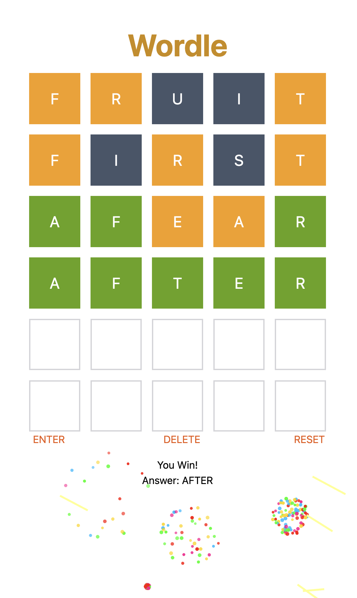

  

# Wordle

Guess the Wordle in 6 tries.

- Each guess must be a valid 5-letter word.
- The color of the tiles will change to show how close your guess was to the word.

  **Examples**

    

  **W** is in the word and in the correct spot.

    

  **I** is in the word but in the wrong spot.

    

  **U** is not in the word in any spot.

## About

Recreated Wordle using React, TypeScript, and Tailwind CSS for two versions. One is to use Redux to be a state container. The other is to adapt React hook useReducer to manage state.

## Demo

  

